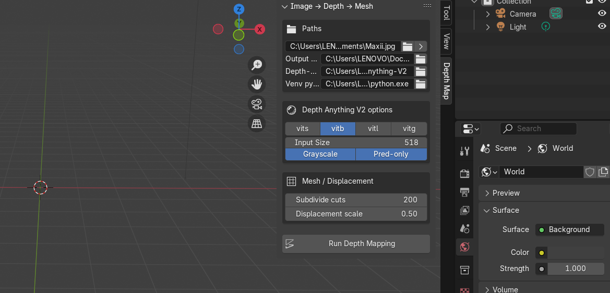

# Image to Depth Map Blender addon

>*Contact me:* catterpi1432@gmail.com 

This README walks you through **setting things up in PyCharm** and then **using the Blender add‑on** to turn an image into a depth map and mesh.  
Every step includes a screenshot so you can follow along quickly.

> **Heads‑up:** In the Blender add‑on UI you **must set your own paths** for:
>
> - **Depth‑Anything‑V2 path** — the folder where you downloaded/cloned Depth‑Anything‑V2.
> - **Venv python.exe** — the Python executable in the virtual environment that has the dependencies installed.
>
> Use paths **relative to where _you_ installed the files** on your machine.

---

>**Important Setup**   Clone the Depth-Anything-V2 repository and also download the base model for now.
>
>Links:
>
>Github-Repo: https://github.com/DepthAnything/Depth-Anything-V2
>
>Base model: https://huggingface.co/depth-anything/Depth-Anything-V2-Base/resolve/main/depth_anything_v2_vitb.pth?download=true

## Using this repo:
1. Clone the project
```bash
    #Clone the project
    git clone https://github.com/DepthAnything/Depth-Anything-V2
```
2. Install the requirements
```bash
    #Installing requirements
    pip install -r Depth-Anything-V2/requirements.txt
```

3. Install the model
```bash
    #Download model from link above
    cd Depth-Anything-V2
    
    #Create a folder called checkpoints
    mkdir checkpoints
    #Add the downloaded model inside checkpoints folder
```

4. Run Commands
```bash
    #To run on a particular image:
    python run.py --encoder vitb --img-path assets/examples/foot.jpg --outdir depth_result --grayscale --pred-only 
```


## 1) PyCharm setup & depth inference

### Step 1 — Open the project
Open the repository in **PyCharm**. Ensure the `Depth-Anything-V2` folder is present (with its `checkpoints/` and `requirements.txt`).  


### Step 2 — Verify the script & example assets
You can use `run.py` (provided) to run inference on an example like `assets/examples/foot.jpg`.  


### Step 3 — Run the command
From the built‑in terminal, run:

```bash
python run.py --encoder vitb --img-path assets/examples/foot.jpg --outdir depth_result --grayscale --pred-only
```

you can also run various other commands from the DepthAnything scripts text file in this repository.

This will write the depth results into `depth_result/`.  
If you see a note like _“xFormers not available”_, that's okay — it will still run on CPU.  


---

## 2) Install & enable the Blender add‑on

### Step 4 — Install from disk
In **Blender** go to **Edit → Preferences → Add‑ons**, click the **⋮** menu and choose **Install from Disk…**  


### Step 5 — Pick the add‑on file
Select `image_to_depth_addon.py` and click **Install from Disk**.  


### Step 6 — Enable the add‑on
Search for **Image to Depth** in the Add‑ons list and enable it.  


---

## 3) Use the add‑on (Image → Depth → Mesh)

### Step 7 — Configure paths & options
Open the **Image → Depth → Mesh** panel in the **Sidebar** (press `N` in the 3D Viewport if it’s hidden).

- **Input image**: path to the image you want to convert.
- **Output folder**: where depth maps and meshes will be written.
- **Depth‑Anything‑V2 path**: the folder where Depth‑Anything‑V2 lives on **your** machine.  
- **Venv python.exe**: your virtual‑env Python executable (e.g. `...\.venv\Scripts\python.exe`).  
- **Encoder**: pick from `vits`, `vitb`, `vitl`, `vitg` (try `vitb` first).  
- **Input size**: default works well for many images.  
- **Grayscale / Pred‑only**: match the command‑line flags above if desired.  
- **Mesh / Displacement**: tweak subdivision cuts and displacement scale.  

> **Important NOTE:** Both **Depth‑Anything‑V2 path** and **Venv python.exe** **must be set by you** according to where you installed things locally.  
> Use **relative paths** in your project if you plan to share the repository.



### Step 8 — Run depth mapping
Click **Run Depth Mapping**. Blender will generate the depth map and (optionally) create a displaced mesh you can further edit and render.  


---

## Troubleshooting

- **Module or import errors**: double‑check that your **virtual environment** contains the dependencies from `Depth-Anything-V2/requirements.txt` and that the add‑on points to the **same** Python executable.
- **Checkpoints missing**: download the required model checkpoint (e.g. `depth_anything_v2_vitb.pth`) into `Depth-Anything-V2/checkpoints/`.
- **Nothing appears in Blender**: verify the **Output folder** is writable and that the **Input image** path is correct.

---

## Repository layout (suggested)

```
.
├─ image_to_depth_addon.py
├─ Depth-Anything-V2/
│  ├─ checkpoints/
│  ├─ assets/
│  └─ requirements.txt
├─ depth_result/            # (created after running)
└─ README.md
```

Happy depth‑mapping!
